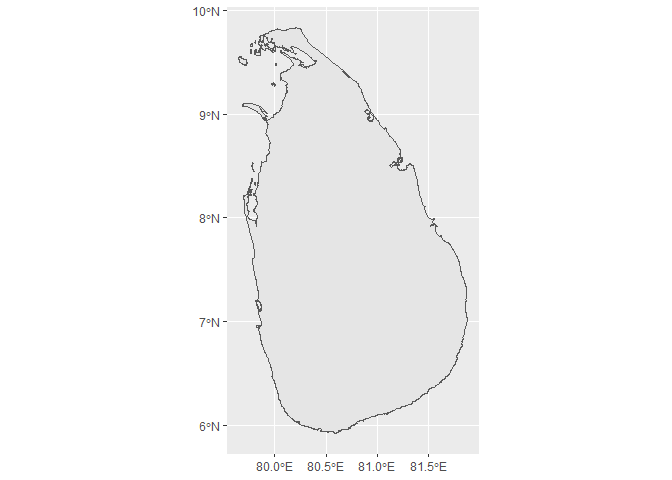
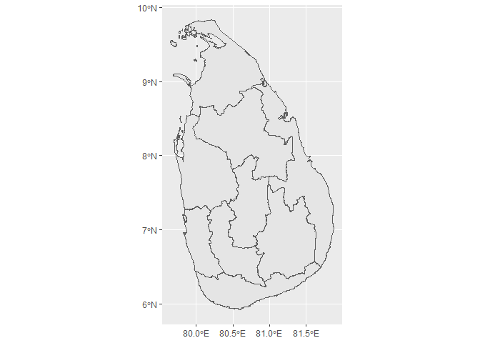
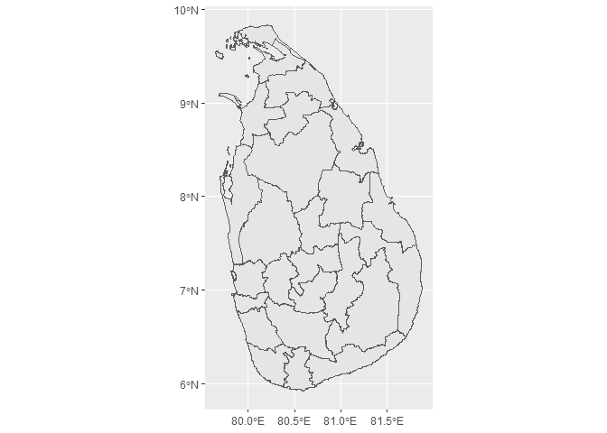
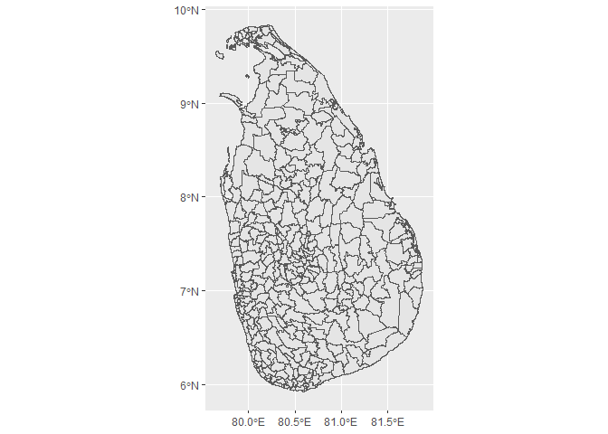

<!-- README.md is generated from README.Rmd. Please edit that file -->

# SriLanka

The goal of `SriLanka` is to provide simple feature objects to plot Sri
Lanka maps.

## Installation

You can install the development version of `SriLanka` from
[GitHub](https://github.com/) with:

``` r
# install.packages("devtools")
devtools::install_github("thiyangt/SriLanka")
```

## Example

``` r
library(SriLanka)
#> Loading required package: sf
#> Linking to GEOS 3.13.1, GDAL 3.10.2, PROJ 9.5.1; sf_use_s2() is TRUE
## basic example code
library(ggplot2)
library(sf)
st_crs(lka_adm0)
#> Coordinate Reference System:
#>   User input: WGS 84 
#>   wkt:
#> GEOGCRS["WGS 84",
#>     DATUM["World Geodetic System 1984",
#>         ELLIPSOID["WGS 84",6378137,298.257223563,
#>             LENGTHUNIT["metre",1]]],
#>     PRIMEM["Greenwich",0,
#>         ANGLEUNIT["degree",0.0174532925199433]],
#>     CS[ellipsoidal,2],
#>         AXIS["latitude",north,
#>             ORDER[1],
#>             ANGLEUNIT["degree",0.0174532925199433]],
#>         AXIS["longitude",east,
#>             ORDER[2],
#>             ANGLEUNIT["degree",0.0174532925199433]],
#>     ID["EPSG",4326]]
lka_adm0
#> Simple feature collection with 1 feature and 5 fields
#> Geometry type: MULTIPOLYGON
#> Dimension:     XY
#> Bounding box:  xmin: 79.65064 ymin: 5.918925 xmax: 81.87898 ymax: 9.835791
#> Geodetic CRS:  WGS 84
#> # A tibble: 1 × 6
#>   Name      Level ISO_Code    id feature_id                             geometry
#>   <chr>     <chr> <chr>    <dbl> <chr>                        <MULTIPOLYGON [°]>
#> 1 Sri Lanka ADM0  LKA          1 LKA_ADM0_010300_1 (((79.78337 8.262939, 79.781…
ggplot(lka_adm0) + 
  geom_sf()
```



``` r
ggplot(lka_adm1) + 
  geom_sf()
```



``` r
ggplot(lka_adm2) + 
  geom_sf()
```



``` r
ggplot(lka_adm3) + 
  geom_sf()
```



``` r
data(historical.paintings.locations)
head(historical.paintings.locations)
#> # A tibble: 6 × 9
#>   Kingdom      Location  Period Century UNESCO_heritage District Province Source
#>   <chr>        <chr>     <chr>  <chr>   <chr>           <chr>    <chr>    <chr> 
#> 1 Anuradhapura Vessagir… <NA>   5       <NA>            Anuradh… North C… https…
#> 2 Anuradhapura Sigiriya  <NA>   5       Yes             Matale   Central  https…
#> 3 Kandy        Dalada M… Kandy  17      Yes             Kandy    Central  https…
#> 4 Kandy        Degaldor… Kandy  18      <NA>            Kandy    Central  https…
#> 5 Kandy        Dambulla… Kandy  1st BCE Yes             Matale   Central  https…
#> 6 Kandy        Medawala  Kandy  <NA>    <NA>            Kandy    Central  https…
#> # ℹ 1 more variable: Accessed_date <dttm>
```
